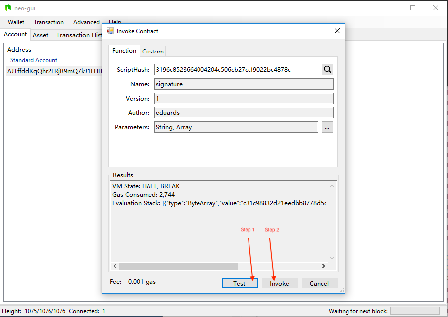

---

### Online demo

Online demo can be viewed at [http://esignature.network](http://esignature.network/)

Source code - <https://github.com/ANDIT-Solutions/neo-esignature>

---


---

### Idea

**Identity** is big part of NEO Smart economy, and for **digital identity online **electronic document signing is big part of it.

**Blockchain** has been around 10 years now and providing option to store something online that no single entity can remove is ideal solution to prove digital document creation.

To prove that I created document at specific time I don’t need to store all file in blockchain all i need is to store file hash. But it’s not enough, we need prove time when I created this document, that’s why we need to store this document in blockchain. When we store it, it is stored at specific block height at blockchain. Each block has known time when it was created and information.

### Use cases

* Designer came up with new Logo idea, hi then signed this logo image online.
* Engineer created new formula for efficient rocket fuel, he created digital document and signed this document online with his NEO wallet.
* Developer came up with groundbreaking storage algorithm, he signed code library online.
* Payment provider signs his incoming payments online automatically, so he can prove that these are the amounts he have processed and transactions are not tampered with.
* System sign important event logs online, so owner can prove them later that there was no tampering with logs.

### What is eSignature.network?

**eSignature** is tool that provides option for you to attach your online identity to digital documents.

By combining NEO identity with NEO smart contract esignature.network provides tool for fast and easy way to sign and verify digital document online.

NEO identity (Wallet) + Timestamp (smart contract) = eSignature


**Safety** - Safety of blockchain means no one can delete or change this information. Documents are signed only and there is no private information available about documents. Your secrets are safe.

**
**


**Mobility** - No papers means its easy to store lot of documents digitally. Digital identity and document availability are global.

**
**


**Green** - No papers for document signing.

**
**


**Ease of usage** - It is easy to use form, signing up, no tokens, upload document, verify and downlaod signature file.

**
**


**Affordable and fast** - Its cost only 0.001 gas ($0.025) to digitally sign document, thats x25 times cheaper than in Latvian (LV) e-signature service.

### Technical process overview

---


---

### What happens in smart contract?

User sends invocation with parameters from his wallet.

Smart contracts creates hash from these parameters and store it in blockchain together with current block height.

Signing function:

```python
def Sign(address, document, metadata):
  #cteate key id from address and document hash
	idConcat = concat(address, document)
	docKey = sha1(idConcat)
	#create hash from all parameters
	data = concat(docKey, metadata)
	hash = sha256(data)	
	#check if there is document with this key already stored
	if not checkIfKeyExists(docKey):
	  #store document hash
		StoreKey(docKey, hash) 
		#store document timestamp
		StoreTimestamp(hash)
		return hash
	return False
```

```python
Verification functions:

#function SignOnly
def SignOnly(address, document, metadata):
  #cteate key id from address and document hash
	idConcat = concat(address,document)
	docKey = sha1(idConcat)
	#create hash from all parameters
	data = concat(docKey,metadata)
	hash = sha256(data)	
	#return hash for verification
	return hash
	
#operation getdoctimestamp	
elif action == "getdoctimestamp":
	address = parameters[0]
	document = parameters[1]
	metadata = parameters[2]
	dochash = SignOnly(address, document, metadata)
	docKey = sha1(dochash)
	return GetKey(docKey)
```

### Step 1 - Upload document and fill web form


### Step 2 - Invoke smart contract with parameters generated in application


### Step 3 - Wait while application detects your invoke and download document signature file


### Step 4 - To verify document uplaod original file and signature to verify form.


### Step 5 - If document was not the same as original file, signature verification will fail.


### How to invoke smart contract from NEO-GUI





### Requesting document timestamp proof through NEO rpc-api

This is how other persons can verify document not using our created web tool, this is important for decentralised applications.

**getdoctimestamp** - function that queries blockchain and get requested document timestamp, if any of parameters would be different output would be empty.

**value = 1404** - this is block height this document was signed.

Request:

```json
{
  "jsonrpc": "2.0",
  "method": "invoke",
  "params": [
    "3196c8523664004204c506cb27ccf9022bc4878c",
    [
      {
        "type": "String",
        "value": "getdoctimestamp"
      },
      {
        "type": "Array",
        "value": [
          {
            "type": "ByteArray",
            "value": "0ff0264fe001bc65624aa5333dbcf903b60856b8"
          },
          {
            "type": "ByteArray",
            "value": "e6604b6cfc82e437aa43efd0a61797d3fde0d239cd8fa746b6e04435f77848b3"
          },
          {
            "type": "ByteArray",
            "value": "7e3975e060bc507e1015ae0eae647497e7290a8c4d7ed0ff9b8f7c45794839ea"
          }
        ]
      }
    ]
  ],
  "id": 1
}
```

Response:

```json
{
  "jsonrpc": "2.0",
  "id": 1,
  "result": {
    "script": "207e3975e060bc507e1015ae0eae647497e7290a8c4d7ed0ff9b8f7c45794839ea20e6604b6cfc82e437aa43efd0a61797d3fde0d239cd8fa746b6e04435f77848b3140ff0264fe001bc65624aa5333dbcf903b60856b853c10f676574646f6374696d657374616d70678c87c42b02f9cc27cb06c5044200643652c89631",
    "state": "HALT, BREAK",
    "gas_consumed": "0.405",
    "stack": [
      {
        "type": "ByteArray",
        "value": "1404"
      }
    ],
    "tx": "d1017e207e3975e060bc507e1015ae0eae647497e7290a8c4d7ed0ff9b8f7c45794839ea20e6604b6cfc82e437aa43efd0a61797d3fde0d239cd8fa746b6e04435f77848b3140ff0264fe001bc65624aa5333dbcf903b60856b853c10f676574646f6374696d657374616d70678c87c42b02f9cc27cb06c5044200643652c89631000000000000000000000000"
  }
}
```

### Signature file format

```json
{
   "key": "f489a6e8e0c680127f4abc3c4f19ffc89493239e",
   "addressScriptHash": "1d76e3a6d1b5698a9395a025245b5dc2afa8fe61",
   "contractScriptHash": "3196c8523664004204c506cb27ccf9022bc4878c",
   "signatureHash": "62ac56265247453a74ece9e4a6ac9f98e46a301614529ab9797a7b6072d788bb",
   "fileHash": "f65412cb711a6e91a597da118cceb552081aa7d1f0c9091c5e760fa94c9ed6fd",
   "metaDataHash": "adee37b20de2e31608b35e084aa7daa40df938de32ef142324cf9b815a4b6af6",
   "docHash": "90b06ed07bf18204561621e35064f08e3079718e5c3621daa38874995c2bbfa2",
   "metaData": {
       "title": "Title",
       "description": "this is my description",
       "firstname": "Johny",
       "lastname": "Bravo"
   },
   "timestamp": 1456
}
```

### Technology used for this project

* Angular.js
* Node.js
* Neon-js
* Python Boa
* Neo-python

### Future vision

Since NEO Auth and NEO identity still is under heavy development there is lot of room for improvements.

1\. eSignature project should be integrated with NeaAuth for correct address identification.

2\. We would suggest for future to create NEO link standart for browser plugins where you can send parameters to wallet, and you can invoke contracts very easy.

Example:

`neoinvoke:3196c8523664004204c506cb27ccf9022bc4878c?param1=functionname&param2=hexstring&gas=0.002&neo=1`

3\. Create offline web only version of signature.network where you can safely add your private key to sign transactions 

4\. Provide option for users to store their source file and signature in cloud.

5\. NeoAuth + NEO eSignature very close integration

6\. eSignature integration in wallets.

7\. Sign only option, that is not using NEO key/value storage for scalability

8\. API endpoint for machine to machine data signing (Identity is not only for humans :) )

9\. Go beyond single blockchain helping NeoX verify entities.


---


By ANDIT Developer Team

